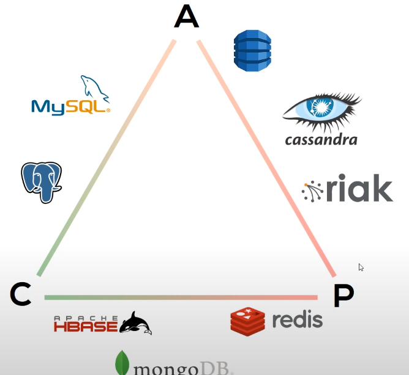
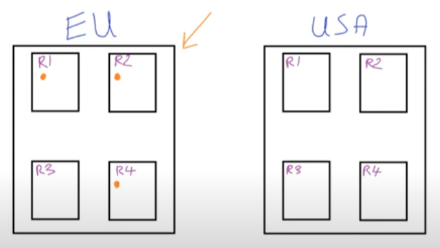

# My notes on [this Cassandra Playlist](moz-extension://52fed1c9-f5c5-43e9-966e-30fe8a7db6a0/data/blocked/index.html?url=https://www.youtube.com/watch?v=s1xc1HVsRk0&list=PLalrWAGybpB-L1PGA-NfFu2uiWHEsdscD) 

## [Apache Cassandra - Tutorial 1 - Introduction to Apache Cassandra](https://www.youtube.com/watch?v=s1xc1HVsRk0&list=PLalrWAGybpB-L1PGA-NfFu2uiWHEsdscD)

**Docs**

https://cassandra.apache.org/doc/latest/  https://docs.datastax.com/en/cql-oss/3.3/index.html

Cassandra is used a lot by big tech firms

It's a distributed database

Its **writes** are really fast

It solves problems in Big Data, IoT, and projects with timeseries data

Cassandra uses a column-oriented approach to storing and querying  data, as opposed to relational databases which take a row approach ==> which can be inefficient

Columnar databases tend to store each column as a separate file ==> fast lookups on particular fields

E.g. 


In a relational DB, to get the **name**, we'd have to go through each row

In a columnar DB, we can go straight to name

In a columnar DB, each value (except Id) is stored as a `key:value` pair: {Name: Brian}, etc.

This also helps us **compact** the data

E.g.


In a columnar DB, we can just leave data empty. There are no nulls we have to fill

https://cassandra.apache.org/_/index.html ==> 

- Fault tolerant: data automatically replicated
- Performant: it’s really fast
- Decentralized: no single point of failure
- Scalable: e.g. Apple - + 75 000 nodes storing over 10 PB of data
- Elastic: read/writes increase linearly as machines are added

## [Apache Cassandra - Tutorial 2 - The CAP Theorem](https://www.youtube.com/watch?v=82wuPR5exmM&list=PLalrWAGybpB-L1PGA-NfFu2uiWHEsdscD&index=2)

**CAP (Brewer’s) Theorem**

****


A distributed database can only have 2 of the above at any one time

A note on consistency: all the **nodes** should return the same data right after update or delete

As a data developer, What combo do we pick?

==> Over a big enough system, some nodes are going to fail from time to time, so we need our system to be partition tolerant. Our now our choice boils down to: do we want our data to also be **consistent** or **available**?

Where does Cassandra fit in?




==> **Availability (less Consistency) + Partitioning** 

Depending on how you set up your cluster, Cassandra can be consistent.

(in fact CAP theorem has been revised in 2012 - DDBs can be both somewhat consistent and available)

## [Apache Cassandra - Tutorial 4 - Installing Cassandra On Linux](https://www.youtube.com/watch?v=pGhkX5z_vW8&list=PLalrWAGybpB-L1PGA-NfFu2uiWHEsdscD&index=4)

**(watch as needed)**

## [Apache Cassandra - Tutorial 5 - Query First Approach](https://www.youtube.com/watch?v=5LTs-G308wY&list=PLalrWAGybpB-L1PGA-NfFu2uiWHEsdscD&index=5)

Remember, relational databases **relate** records in one table to another table

A common operation in RDBs are *JOINS*

JOINS are good when our data is on a single machine. On several machines, however, we need to use a lot of **LOCKS**, which slows up our DB

Cassandra gets a lot of its speed from never having to perform JOINS 

(it is impossible... if you really want to slow down Cassandra to achieve a particular query)

Cassandra takes a QUERY-FIRST APPROACH ==> we design our tables for a specific query

i.e. Every table caters for a specific query 

This is ideal for Cassandra’s distributed architecture

===> We now understand that setting up the tables is critical in Cassandra

**Relational design**


**Query first design**


**Cassandra** 


The first column is known as the **Partition Key**

Overall this design means that Cassandra really performs when you need to scale!

## [Apache Cassandra - Tutorial 6 - Partitioning, Rings and Tokens](https://www.youtube.com/watch?v=Soaod2WRmlg&list=PLalrWAGybpB-L1PGA-NfFu2uiWHEsdscD&index=6)


Taking the previous example with the first table, the partition key is **car make**. We want to be sure when we query, for example: `SELECT * from EmployeeByCarMake where CarMake = ‘BMW’`, that these rows are all stored on the same node in the cluster so Cassandra can read and return them fast.

On the 2nd table, the partition keys are unique, so it doesn’t make sense to store them on the same node.

The **partition key** doesn’t have to be unique 

We query by partition keys in Cassandra

The **primary key** is unique. It can be part of the table and returned with the row. 

We can use the primary key as the partition key


In Cassandra, all partition keys are hashed into tokens 

E.g. BMW → Hash Function → 234

​    Audi → Hash Function → 134

Cassandra uses the token to decide which node the data will be stored

Tokens are 64 bit integers: -2^63 → 2^63 - 1

**<u>Cassandra node ring example</u>** 

Each node is assigned a token:


E.g. tokens between 0 - 10 are stored on node 1; between 0 - 10 stored on node 2, and so on.

Cassandra creates [virtual nodes](https://docs.datastax.com/en/cassandra-oss/3.0/cassandra/architecture/archDataDistributeVnodesUsing.html)

They help Cassandra to add new nodes to the cluster, which helps balance the cluster

E.g. node 1 has more storage than node 2 ==> assign node 1 more virtual nodes

## [**Apache Cassandra - Tutorial 7 - Replication, Data Centers and Racks**](https://www.youtube.com/watch?v=yyVbDBSMnUw&list=PLalrWAGybpB-L1PGA-NfFu2uiWHEsdscD&index=7)

Cassandra can be used across multiple data centers, boosting resilience

When data is replicated, we ensure our data is accessible if a server is temporarily down

**A Cassandra rack is a logical grouping of nodes within the ring**. In other words, a rack is a collection of servers. The database uses racks so that it can ensure replicas are distributed among different logical groupings. As a result, it can send operations not only to just one node. Multiple nodes, each on a separate rack, can provide greater fault tolerance and availability.

A **datacenter** is a logical set of racks

Data in one rack can be replicated on other racks in the datacenter

E.g. 2 datacenters




Cassandra config files are located in `/etc/cassandra/` ==> `cassandra.yaml`, `cassandra-rackdc.properties`

Every **keyspace** (similar to a DB in a RDB) has a replication factor

E.g. 


Let’s say we hash our PF to a token of 5, it gets stored on the 1st node. It is then copied to nodes 2 and 3, to satisfy the RF = 3. 

**??? But I thought only data of a certain token can get replicated on a particular node ???**

## [**Apache Cassandra - Tutorial 8 - CQL - Keyspaces and Tables**](https://www.youtube.com/watch?v=91ZwkO07xHU&list=PLalrWAGybpB-L1PGA-NfFu2uiWHEsdscD&index=8)

CQL is similar to SQL, with some important differences:

- CQL has no JOINS!
- Clusters have one or more keyspaces, the outermost container for data in Cassandra

Cassandra Shell = cqlsh

Setting up a keyspace:

`CREATE KEYSPACE test_keyspace WITH replication = {‘class’: ‘SimpleStrategy’, ‘replication_factor’: ‘1’} AND durable_writes = ‘true’`

`DESCRIBE KEYSPACES`

`USE <KEYSPACE>`

Primary Key (Composite Key) = Partition Key + Clustering Columns

Clustering Columns are used for sorting data within a partition

```CQL
CREATE TABLE employee_by_id (
  id int PRIMARY_KEY,
  name text,
  position text
)
```

```cql
CREATE TABLE employee_by_car_make (
  car_make text,
  id int,
  car_model text,
  PRIMARY KEY(car_make, id)
)
```

```cql
CREATE TABLE employee_by_car_make_sorted (
  car_make text,
  age int,
  id int,
  name text,
  PRIMARY KEY(car_make, age, id)
)
```

We can use multiple columns as the partition key

E.g. if there is one popular *car_make*, then mostly one node will be targeted. If we also specify the *car_model*, however, we can even the load:

```cql
CREATE TABLE employee_by_car_make_and_model (
	car_make text,
  car_model text,
  id int,
  name text,
  PRIMARY KEY((car_make, car_model), id)
)
```

## [Apache Cassandra - Tutorial 9 - CQL - Consistency, Inserts and Selects](https://www.youtube.com/watch?v=QA-owFLFNcQ&list=PLalrWAGybpB-L1PGA-NfFu2uiWHEsdscD&index=9)

Assume a RF of 3 (standard when learning Cassandra)

Consistency: **Any** ⇒ Successful WRITE = when data is written to Any 3 nodes in the ring

Consistency: ONE/**TWO**/THREE/<RF> ⇒ Successful WRITE = when data is written to **2** nodes 

With a consistency 1 READ ⇒ Successful READ when data from **1** node is received, even if it’s not up to date

With a consistency 2 READ ⇒ Successful READ when data from **2** nodes are received. Cassandra will wait, compare, and send the latest version to the client. It will then patch the old data on-the-fly.

Consistency **Quorum** ⇒ ensures a WRITE was received by at least a majority of replicas. During READS it queries all nodes and once a majority of replicas respond it returns the value with the most recent timestamp

\# nodes queried in a quorum read = (RF + 1) / 2, (rounded up?)

**Inserting data** (like SQL)

```cql
INSERT INTO employee_by_id (id, name, position)
VALUES (1, ‘John’, ‘Manager’);
```

**Querying data** (like SQL)

```cql
SELECT * FROM employee_by_id WHERE id=1;
```

```cql
SELECT * FROM employee_by_id WHERE name=’Bob’;
```

==> produces an error, because `name` is not the partition key

we can use `ALLOW FILTERING`, but this will produce an unperformant query - **not recommended**

You can use `ORDER BY` with clustering columns 

```cql
SELECT * FROM employee_by_car_make
WHERE car_make=’BMW’
ORDER BY car_model;
```

If you insert data with the same partition key, it will update the existing record

## [**Apache Cassandra - Tutorial 10 - CQL - Timestamps, TTLs, Collections and Secondary Indexes**](https://www.youtube.com/watch?v=2YxV1Ia0evc&list=PLalrWAGybpB-L1PGA-NfFu2uiWHEsdscD&index=10)

We can get the **writetime** of inserted data

```cql
SELECT car_make, car_model, writetime(car_model) 
FROM employee_by_car_make;
```

We can UPDATE specific row’s column ==> `[i][j]`

```cql
UPDATE employee_by_car_make
SET car_model=’TRUCK’
WHERE car_make = ‘BMW’ AND id=1
```

We can give data a set life with TTL (time to live)

```cql
UPDATE employee_by_car_make 
USING TTL 60 
SET car_model=’TRUCK’
WHERE car_make=’BMW’ AND id=2
```

Where are TTLs useful? 

⇒ session tokens, ...

After TTLs expire, values do not revert to any previous value. They are set to null.

## [Apache Cassandra - Tutorial 11 - CQL - UUIDs and Counters](https://www.youtube.com/watch?v=7fL4AZ8gsug&list=PLalrWAGybpB-L1PGA-NfFu2uiWHEsdscD&index=11)

Cassandra has [2 forms of UUID](https://docs.datastax.com/en/cql-oss/3.3/cql/cql_reference/uuid_type_r.html):

1. UUID
2. Timeuuid

1)

```cql
CREATE TABLE employee_by_uuid (id uuid PRIMARY KEY, first_name text, last_name text);
```

```cql
INSERT INTO employee_by_uuid (id, first_name, last_name)
VALUES (uuid(), ‘tom’, ‘dunne’);
```

2)

```cql
CREATE TABLE employee_by_timeuuid (id timeuuid PRIMARY KEY, first_name text, last_name text);
```

```cql
INSERT INTO employee_by_timeuuid (id, first_name, last_name)
VALUES (now(), ‘tim’, ‘jones’);
```

“TIMEUUID columns are sorted by their time components first, and then by their raw bytes, whereas UUID columns are sorted by their version first, then if both are version 1 by their time component, and finally by their raw bytes.” -- https://stackoverflow.com/a/17951786

**Counters** are used to track things like #_views on a website, #_items in stock, etc. They are only ever incremented or decremented by one each transaction.

Keeping track of counters in a distributed database is a challenge

Therefore, there are limitations on counters in Cassandra:

- They can only be created in dedicated tables
- They can’t be assigned to primary/partition keys
- We can’t index or delete a counter column

https://docs.datastax.com/en/cql-oss/3.3/cql/cql_using/useCountersConcept.html

```cql
CREATE TABLE purchases_by_customer_id (id uuid PRIMARY KEY, purchases counter);
```

Data is updated, not inserted, in *counter* tables

```cql
UPDATE purchases_by_customer_id
SET purchases = purchases + 1
WHERE id = uuid();*
```

## [Apache Cassandra - Tutorial 12 - CQL - Importing and Exporting Data](https://www.youtube.com/watch?v=N71NwCKfyQ4&list=PLalrWAGybpB-L1PGA-NfFu2uiWHEsdscD&index=12)

**(Skip)**

## [Apache Cassandra - Tutorial 13 - CQL - Materialized Views](https://www.youtube.com/watch?v=XhNIU7X_HUU&list=PLalrWAGybpB-L1PGA-NfFu2uiWHEsdscD&index=13)

Materialized views are used when we have data we wish to query which is not a part of the primary key


```cql
SELECT * FROM employee_by_car_make
WHERE car_make = ‘BMW’
AND department = ‘HR’ 
//this is not possible!
```

We need to create a **materialized view (table)** on department using a **base table** of `employee_by_car_make`

```cql
CREATE MATERIALIZED VIEW test_keyspace.employee_by_department
AS SELECT * 
FROM test_keyspace.employee_by_car_make
WHERE department IS NOT NULL AND
car_make IS NOT NULL AND
car_model IS NOT NULL AND
id IS NOT NULL
PRIMARY KEY (department, car_make, car_model, id);
```

The original primary key must be defined in the materialized view

```cql
SELECT * FROM test_keyspace.employee_by_department;
```

**

Now we can do:

```cql
SELECT * FROM test_keyspace.employee_by_department
WHERE department = ‘HR’;
//etc
```

**How are materialized views kept up-to-date with the base table?**

```cql
UPDATE employee_by_car_make
SET department = ‘IT’
WHERE car_make = ‘AUDI’ AND car_model = ‘Saloon’ AND id=2;
```

**The materialized view will be automatically updated!**

## [Apache Cassandra - Tutorial 14 - Peer To Peer Architecture](https://www.youtube.com/watch?v=KMrNK58jei0&list=PLalrWAGybpB-L1PGA-NfFu2uiWHEsdscD&index=14)

Cassandra uses a P2P approach rather than a Leader-Follower approach

**P2P** 

- Every node considered equal
- Replicas are independent of each other

We can write to any node on the cluster

(E.g. with a RF = 3)

Whichever node first receives the read/write request, becomes the **coordinator node**.


What if there is a network partition in our cluster?

It depends…


On the LHS (with Quorum) we still have read/write success, as we can communicate 2 of the 3 nodes. After the partition disappears, the hidden node will be updated.

On the RHS, we would fail.

Most *clients* are “cluster aware”, meaning they will choose the best coordinator node across the partition to minimize issues

## [Apache Cassandra - Tutorial 15 - Snitch](https://www.youtube.com/watch?v=8XOYxelFzak)

https://cassandra.apache.org/doc/latest/cassandra/architecture/snitch.html

The snitch monitors every rack, keeping track of which data center and rack it is located

The snitch decides which will be the most responsive nodes for our request

Config:

**Simple Snitch** - assumes all nodes are in the same data center and rack ==> fine in testing; not in production

**Property File Snitch** 

**GossipingPropertyFileSnitch** (see the docs) ===> recommended for production

The **Dynamic Snitch** monitors the performance of all the nodes in the cluster using the **Gossip Protocol** 

The dynamic snitch monitor read latencies to avoid reading from hosts that have slowed down. The dynamic snitch is configured with the following properties on `cassandra.yaml`

## [Apache Cassandra - Tutorial 16 - Gossip Protocol](https://www.youtube.com/watch?v=1b1mrNB6zjQ)

The [Gossip Protocol](https://en.wikipedia.org/wiki/Gossip_protocol) behaves like a virus

https://docs.datastax.com/en/cassandra-oss/3.x/cassandra/architecture/archGossipAbout.html

The idea is that eventually all nodes know the states of all other nodes in cluster

The protocol is actually quite efficient and doesn’t eat up lots of bandwidth

A gossip message looks like: 

**Heartbeat State**

- When it started
- Timestamp

**Application State**

- Status (normal/leaving/joining the cluster)
- Data center node is in
- Rack node is in
- Schema (tables, keyspaces)
- Load (disk)
- Severity (i/o)

The load + severity give us a good idea what condition the node is in

Gossip keeps all the nodes up to date (see min 7 of the video for more detail)

## [Apache Cassandra - Tutorial 17 - Cassandra Write Path](https://www.youtube.com/watch?v=lGE_v5Rn4Ps)

Cassandra runs in the JVM

https://cassandra.apache.org/doc/trunk/cassandra/architecture/storage_engine.html#memtables

https://cassandra.apache.org/doc/latest/cassandra/architecture/storage_engine.html

When a record is written to both the **memtable** and the **commitlog** then it can be returned to the client as successful 

The Commitlog doesn’t care about order (clustering column), but the Memtable does

Eventually the memtable is flushed to disk ===> it creates a SSTable (immutable)

===> And a new memtable and commitlog are created

If we’re using spinning discs, it’s best to split the commitlog and memtable to reduce contention between the two processes

On a SSD, this doesn’t matter (due to its non-mechanical structure)

Less SSD tables are better

## [Apache Cassandra - Tutorial 18 - Cassandra Read Path](https://www.youtube.com/watch?v=PzEzRBovKsI)

When we get a request to read data in Cassandra, we have to search the memtables and the SStables

The memtable is always more up-to-date than the SS tables


Through steps 1 - 5, We should never hit the SS table directly, by the very least the partition index will point us to the right place to start reading before. Otherwise, reads would be very slow.

https://cassandra.apache.org/doc/latest/cassandra/operating/bloom_filters.html

## [Apache Cassandra - Tutorial 19 - Compaction](https://www.youtube.com/watch?v=mTY3RdkzOuU)

Housekeeping operation. 

Cassandra tries to store data as efficiently as possible. 

Example:


SSTable3 is written to disk ===> SSTable1 and SSTable2 can then be deleted

https://cassandra.apache.org/doc/latest/cassandra/operating/compaction/index.html

## [Apache Cassandra - Tutorial 20 - Datastax C# Driver](https://www.youtube.com/watch?v=Wm_yeBKGsJQ)

**(Skip)**